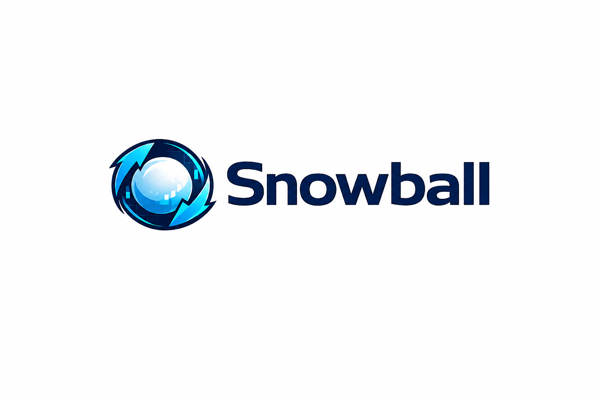

<p align="center">
  <picture>
    <source media="(prefers-color-scheme: dark)" srcset="assets/logo.png">
    
  </picture>
</p>

<p align="center">
  
  
  
  
</p>

# ❄️ Snowball — Funding-Rate Arbitrage (delta-neutral)

> A bot that stays **long on one exchange and short on another**, on the same
> asset, at the same time. Price exposure is **zero by construction** — if the
> asset goes up or down, the two legs cancel out. The profit comes from the
> **funding rate**: the payment one exchange transfers to the other every 8h.
> It doesn't bet on direction — it **charges for liquidity**.

> ⚠️ **Everything is paper trading.** No real order is ever placed. The goal is
> to validate the strategy against real market data (real fees, funding and
> liquidity) before risking any real money.

---

## 🎯 Current plan: single 2-exchange engine + spot-perp

The system started with **6 exchanges** (the "Champion") as a reference/benchmark
— after serving to discover the profit levers, it was **archived** (see
[`arquivo-6-exchanges/README.md`](arquivo-6-exchanges/README.md); code preserved,
just no longer running). The focus is now 100% on **2 exchanges, US$100 on each**:
the head-to-head between pairs is over.

**Decision made:** `bybit + bitget` won the head-to-head against `gate + okx`
(which starved — almost no positions opened). The two competitors were
consolidated into a **single engine**, `snowball-2ex`, with every maximization
lever already built in:

| Lever | What it does |
|---|---|
| **Maker (limit) orders** | cost drops from ~40% of funding to ~15% — exact math from the real presets (`--cost-model maker`) |
| **Persistence filter** | only enters after 30min of a positive signal — cuts premature entries, the #1 cause of cost leakage (`--persist-min 30`) |
| **Capital utilization** | 6 positions, 20% reserve (`--maxpos 6 --reserva 0.20`) |
| **Idle-reserve yield** | the reserve earns ~6%/year in the cash ledger, neutral (`--stable-yield 0.06`) |
| **Entry safety margin** | requires APR to cover 2.5× the fixed cost before opening (`--entry-safety-mult 2.5`) |
| **Compounding** | profit settled to deployable capital every 24h — frees up more simultaneous positions, not bigger ones (`--settle-interval-h 24`) |

### Spot-perp — a second capture surface (same exchange)
Beyond the cross-exchange leg (which captures the funding **differential** between
2 exchanges), the engine also runs **cash-and-carry**: buy spot + short perp **on
the same exchange**, capturing the **absolute** funding — reaching opportunities
the cross-exchange leg misses. Delta-neutral, same cash ledger, reconciled to the
cent. A dedicated collector (`coletor-spotperp.cjs`) scans the real market via ccxt
and only accepts opportunities with real liquidity **on both sides** (perp and spot).

---

## 🏗️ Architecture

```
   ┌─────────────┐   scans the whole market     ┌──────────────────────────┐
   │  COLLECTOR  │  ~4,750 pairs / 6 exchanges   │  arquivo-observacoes     │
   └─────────────┘        every ~5 min           └───────────┬──────────────┘
                                                              │
   ┌──────────────────┐  spot+perp opportunities    ┌─────────┴────────────────┐
   │ SPOT-PERP COLLECTOR│  (same exchange, real       │  arquivo-spotperp        │
   │ (ccxt, real)       │  liquidity on both sides)   │  (radar feed)            │
   └────────┬───────────┘ ────────────────────────▶  └─────────┬────────────────┘
            │                                                  │
            └──────────────────────┬───────────────────────────┘
                                    ▼
                     ┌───────────────────────────────────┐   ┌──────────────┐
                     │ snowball-2ex (forward-lab)        │   │  DASHBOARD   │
                     │ bybit+bitget · REAL ENGINE        │   │  Command     │
                     │ maker + 30min persistence +        │   │  Center      │
                     │ cross-exchange + spot-perp together │   │  (React,     │
                     └───────────────────────────────────┘   │  live)        │
                                    ▲                          └──────────────┘
                                    └── supervision + hardening (auto-restart) ──▲
```

- **Scanner** (`src/cli/vigilancia.ts`): scans the **whole market** (~4,750 pairs
  across the 6 exchanges) via bulk `fetchFundingRates`, with no selection bias —
  writes `vigilancia/historico.jsonl`.
- **Archiver** (`src/cli/coletor.ts`): only reads what the scanner/custody write and
  archives it forever in `arquivo-observacoes.jsonl` (never queries an exchange) —
  this is the file `snowball-2ex` reads.
- **snowball-2ex** (`scripts/progression/forward-lab.cjs`): the real-money engine —
  bybit+bitget, maker, persistence filter, cross-exchange **and** spot-perp in the
  same reconciled cash ledger.
- **Spot-perp collector** (`scripts/progression/coletor-spotperp.cjs`): scans
  spot+perp on the same exchange via ccxt (real data), only accepts real liquidity
  on both sides.
- **Dashboard** (`dashboard-v2/`): React + read-only API. Command Center with the
  real engine + spot-perp radar.
- **Supervision** (`scripts/supervisor.sh`, `scripts/supervisor-competidores.sh`,
  `scripts/blindagem.ps1`): auto-restart on crash, all windowless.

> The **Champion** (6-exchange reference) was **archived** after serving to discover
> the profit levers above — see [`arquivo-6-exchanges/README.md`](arquivo-6-exchanges/README.md).
> Code preserved, no longer running.

---

## 📁 Project structure

```
src/
  cli/          spread-live · coletor · vigilancia · custodia   (entry points)
  funding/      delta-neutral engine: engine, spread, universe, compound, marking,
                settlement, telegram, real-costs, execution (maker)…
  config.ts     real fee presets per exchange (taker/maker)
  ml/           scanner readiness
scripts/
  progression/  forward-lab.cjs + lib-progression.cjs           (paper competitors)
  analise/      counterfactual, backtest, competitor comparator
  supervisor.sh · supervisor-competidores.sh · blindagem.ps1    (hardening)
dashboard-v2/   React frontend (:5183) + read-only API (:5184)
```

> The project was **trimmed down** (2026-08 refactor): ~256 files of old strategies
> and shadow research that didn't serve the 2-exchange plan were removed. Only what
> improves the funding-arb stayed. Git history preserves everything.

---

## ▶️ How to run

```bash
# 1. dependencies
npm install

# 2. configure Telegram (optional — open/close/profit alerts)
cp .env.example .env   # fill in TELEGRAM_BOT_TOKEN and TELEGRAM_CHAT_ID
npm run telegram:chatid

# 3. bring everything up (engine + scanner + competitors + dashboard), windowless + hardened
powershell -File scripts/blindagem.ps1
```

`blindagem.ps1` is idempotent (won't duplicate). **Auto-start on boot is disabled by
request** — you have to bring it up by hand after restarting the PC.

- **Dashboard:** http://localhost:5183 → **Command Center** (the real engine, capital,
  cross-exchange + spot-perp positions, the opportunity radar, what it's thinking).
- **Test Telegram messages:** `node scripts/telegram-teste-todos.cjs`

---

## 📱 Telegram alerts

Written so anyone can understand them (emojis + separators + explanation):
`🟢 new trade` · `✅ profit` / `⚠️ loss` · `🔁 profit reinvested (snowball)`
· `📊 daily summary` · `🛑 bot paused`.

---

## 🛡️ Safety

- **Paper trading:** no real order is ever placed.
- **Delta-neutral:** zero price exposure by construction.
- **Risk guardian:** closes a position if the price gets close to liquidation.
- **Hardening:** auto-restart on crash + survives reboot, windowless.
- **No committed secrets:** the Telegram token only lives in `.env` (outside git).

---

## 📊 Current status (paper)

| | |
|---|---|
| Champion (6-ex) | **archived** — last state: +US$17.52 in ~6.3 days. See `arquivo-6-exchanges/` |
| snowball-2ex (bybit+bitget, real engine) | US$200 · cross-exchange + spot-perp together |
| Scanner | whole market, ~4,750 pairs, every 5 min |
| Spot-perp radar | ~120 real opportunities (bybit+bitget), profile vol > US$5M on both sides |
| Next step | observe days of continuous operation and measure how much spot-perp adds to funding/day |
